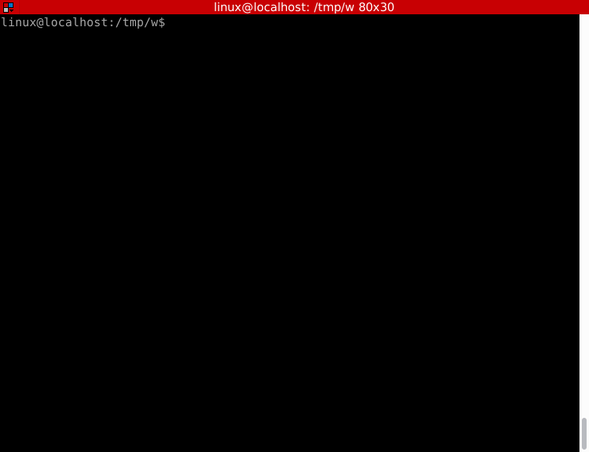
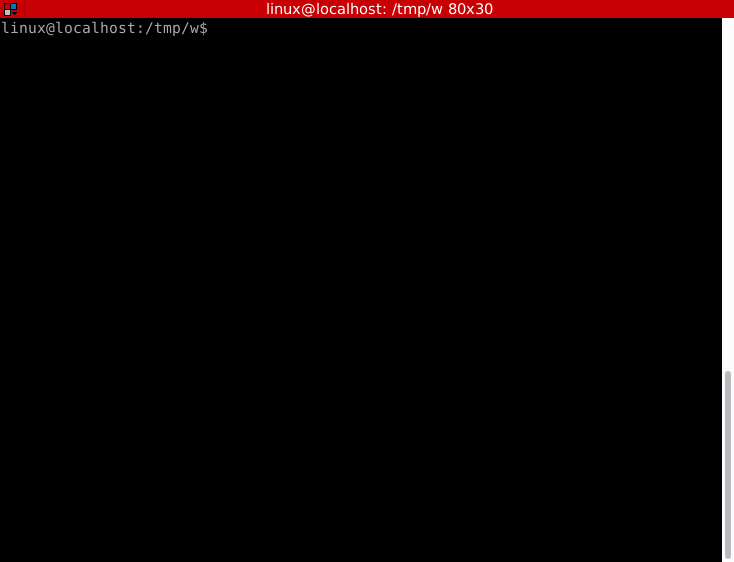
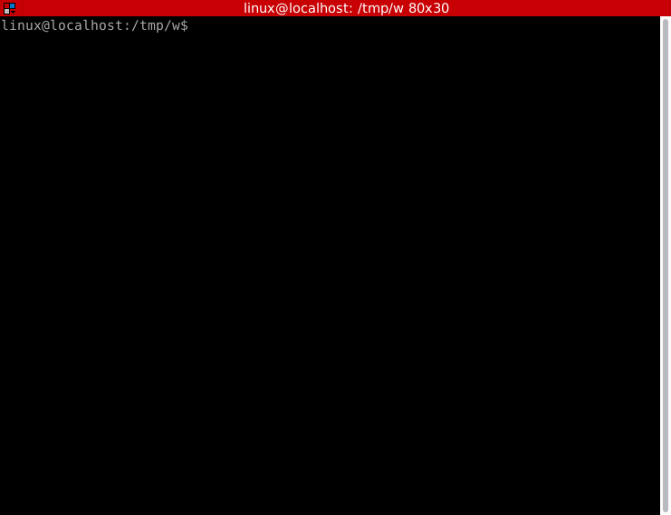

# frozenkrill 🧊🦐
A minimalist Bitcoin wallet focused on cold storage

Loved both by whales 🐋 and small fish 🐟

## ⚠️ WARNING: this software should be considered beta, proceed with caution

# Features
- Brute-force/dictionary attack protection through [argon2id](https://en.wikipedia.org/wiki/Argon2) (for the [key derivation algorithm](https://en.wikipedia.org/wiki/Key_derivation_function)) with a __paranoid__ tuning
  - Minimum 20 seconds/512MB of RAM to derive a key using a modern CPU on default `--difficulty normal`, up to 40 minutes/2GB RAM on `--difficulty veryhard`
- Safe [BIP-39](https://github.com/bitcoin/bips/blob/master/bip-0039.mediawiki) seed generation with the option for the user to **input 12/24 words** (complete seed) or **11/23 words** (automatically generation of the last word/checksum)
- Also implements the following wallet standards:
  -  [BIP-84](https://github.com/bitcoin/bips/blob/master/bip-0084.mediawiki) for singlesig
  -  [BIP-48](https://github.com/bitcoin/bips/blob/master/bip-0048.mediawiki) for multisig
  -  [Output Descriptors](https://github.com/bitcoin/bitcoin/blob/master/doc/descriptors.md) for future-proof compatibility
- Support for any number of [keyfiles](./docs/keyfiles.md), including large ones
- Single, lightweight binary with reduced dependencies
- Simple CLI-interface that makes easy to do safe operations and hard to make unsafe ones
  - Including a password strength checker based on [Dropbox's one](https://github.com/dropbox/zxcvbn)
- Encrypted files are small and look like random data, there are no headers or magic numbers, making it easier to hide them
- Tries to be future-proof by using algorithms with multiple open-source implementations in many languages

More details on [technical details section](./docs/technical.md)

# What is a cold storage wallet?
A cold storage wallet is used to receive and store bitcoins without an internet connection.

If the wallet is manipulated (created or read) in a safe environment, like a trusted offline computer running an ephemeral (no disk installation), minimalist, open-source Unix distribution (Linux/BSD), it's almost impossible to leak the private keys (seed phrases/mnemonics).

Therefore, it's a safe way to _hodl_ bitcoins in the long term.

# Self custody
> 99% of people holding crypto on their own will end up losing it

_-- Old Chinese curse_

Being able to secure the keys of a wallet without losing it is the most challenging aspect of Bitcoin from an user's perspective.

If it's too easy to retrieve the keys, then anyone can do it, therefore the funds will be stolen.

If it's too hard, then even the owner may eventually be unable to do it, causing the funds to be lost.

`frozenkrill` tries to improve the "retrievability" of bitcoin keys by creating an encrypted file that can be backed up to any digital medium securely.

# How frozenkrill works?
frozenkrill is a simple executable that:
1) Generates a strongly encrypted file containing the standard [BIP-39](https://github.com/bitcoin/bips/blob/master/bip-0039.mediawiki) seeds
2) Generate the receiving addresses/xpub from these seeds (and other useful parameters like derivation paths)
3) Can sign any PSBT using the encrypted wallet

If a [keyfile](./docs/keyfiles.md) and a strong password is used, coupled with the builtin brute force protections, it's possible to save the wallet file in relatively unsafe storage system (like cloud providers, email or with friends).

# What are keyfiles?
Please [read this section](./docs/keyfiles.md).

# frozenkrill vs hardware wallets

Before anything, it isn't about using `frozenkrill` _or_ a hardware wallet. The idea is to combine both. In fact, ideally, frozenkrill would run inside a hardware wallet.

For an in depth discussion see [this document](./docs/hw.md)

# Duress wallet (aka plausible deniability aka decoy wallet)
See [our document](./docs/duress.md) about this feature.

# Installation
The recommended way is to download and boot [our minimalist Alpine distribution](https://github.com/planktonlabs/bootable-frozenkrill) without an internet connection on a computer you trust.

For more security considerations, see [this document](./docs/security.md)

Alternatively download the source code or Linux binary on [GitHub Releases](https://github.com/planktonlabs/frozenkrill/releases)

To build from sources, install rust (use [rustup](https://rustup.rs/)), then run on the source directory:

```shell
$ cargo build --release
```
This will create the binary in `target/release/frozenkrill`

Which can be just executed. For instance, to get the help:
```shell
$ target/release/frozenkrill --help
```

To be sure everything is okay on your platform, run the unit and integrations tests with:
```shell
$ cargo test --release --workspace
```

## Other ways of installing

[https://github.com/planktonlabs/frozenkrill](https://github.com/planktonlabs/frozenkrill) and [https://github.com/planktonlabs/bootable-frozenkrill](https://github.com/planktonlabs/bootable-frozenkrill) are the only official repositories.

There are no other official installation alternatives. **Don't trust binaries in package managers or found anywhere else on Internet**.

In future official packages _may_ be added to some Linux/BSD distributions if it makes sense (e.g [Tails](https://tails.boum.org/))

### Does it run on Windows, MacOS, Android/iOS, etc?
Note that `frozenkrill` isn't a general purpose software wallet. It's focused on a very specific use case. The focus is to provide a secure solution to generate private keys that can be stored in digital mediums. [It's an alternative to current-gen hardware wallets for some users](./docs/hw.md)

For PC users, our [ISO image](https://github.com/planktonlabs/bootable-frozenkrill) should be good enough to everyone. (if it's not, [open an issue](https://github.com/planktonlabs/bootable-frozenkrill/issues) describing your use case so we can improve it)

Regarding smartphones, supporting an open-source Android distribution focused on security (e.g [GrapheneOS](https://grapheneos.org/)) is an interesting possibility, but completely untested.

It may run on other operating systems, but in this case a hardware wallet will probably be a better solution.

# Quick-start in interactive mode
Just type `frozenkrill interactive` and choose the options.

(note: `difficulty easy` is used in these examples just for demonstration purposes, better leave it at the default `normal` level in real world usage)

## Generating a wallet


## Generating QR code to receive payments


## Signing a PSBT


## Show the secrets
This will show the **seed phrase** and the private key (**xpriv**). Should be used only on special circumstances. The above method of signing a PSBT is the recommended way to make a transaction.



# CLI examples
## Generate a wallet with a keyfile
```shell
$ frozenkrill singlesig-generate --keyfile cuteimage.jpg mywallet
```
This example uses [keyfiles](./docs/keyfiles.md), the parameter is optional but recommended. It can be called multiple times and also reference directories (that will be transversed recursively), like `--keyfile file1.txt --keyfile file2.jpg --keyfile secretfolder`

The generated **encrypted wallet file** is `mywallet`. This file should be **backed up to multiple places**. **If you lose it, you lose any balance on your wallet**.

The `mywallet_pub.json` will be the file containing the receiving addresses, public keys and other information. I can be generated again if needed with the command `frozenkrill singlesig-open mywallet --keyfile cuteimage.jpg export-public-info`.

Let's take a look at it:
```shell
$ head -n 21 mywallet_pub.json 
{
  "version": 0,
  "sigtype": "singlesig",
  "master_fingerprint": "84577e03",
  "singlesig_xpub": "zpub6rerbAfYxT86ZiHXkVYcJJLMFZzy5MF1gLmjuDFNxwN3NPZEC5PesEhzm5AYY7TJixkEAeFrNFRWEyRKLN9jLtNLeZkk2YchzaPkyL7eXqw",
  "singlesig_derivation_path": "m/84'/0'/0'",
  "multisig_xpub": "Zpub75EVv3vodU4dLT8VaR4eworLZJY1gnKyE1thSST7oQNMvPheFPLNfZhj9em55PyMtcju8A3DzTP3n8HCwgK7JbLJ6KKZf22f4Lw9ouMS2C2",
  "multisig_derivation_path": "m/48'/0'/0'/2'",
  "singlesig_receiving_output_descriptor": "wpkh([84577e03/84'/0'/0']xpub6CzKyqKif638s7uJ5myMt89Ludi5C7G1r7jJLRTcCvcHGBvmgm4Xd7PiifFNYJ9TugWcfh4jSviQUQCBtyKhkR18utMtriyjT8GUCAqCaC7/0/*)#x703tmpk",
  "singlesig_change_output_descriptor": "wpkh([84577e03/84'/0'/0']xpub6CzKyqKif638s7uJ5myMt89Ludi5C7G1r7jJLRTcCvcHGBvmgm4Xd7PiifFNYJ9TugWcfh4jSviQUQCBtyKhkR18utMtriyjT8GUCAqCaC7/1/*)#h22skw3w",
  "script_type": "segwit-native",
  "network": "bitcoin",
  "receiving_addresses": [
    {
      "address": "bc1qrmyaygpejj2kczmuxc29g4mtust8058xz5tuay",
      "derivation_path": "m/84'/0'/0'/0/0"
    },
    {
      "address": "bc1q5shm02hkpexm6mwt695t5hmmsc7lkd4rl0af2n",
      "derivation_path": "m/84'/0'/0'/0/1"
    },

```

The `singlesig_xpub` can be used to generate any address if imported in another wallet. But this isn't necessary as we have already generate many receiving addresses (default: 100). So you can just pick an address and send bitcoins to it.

## Signing a PSBT (Partially Signed Bitcoin Transaction)
Using another wallet (like electrum) to generate a PSBT (`wallet_1-00aacc123.psbt` here), then we can load the encrypted wallet to sign it:

```shell
$ frozenkrill singlesig-open mywallet --keyfile cuteimage.jpg sign-psbt wallet_1-00aacc123.psbt
```

This will generate `wallet_1-00aacc123_signed.psbt`. Which can be loaded again on a wallet connected to a bitcoin node to be broadcasted.

## Generating 3 wallets in a batch, each one containing a 12 word seed phrase
```shell
$ frozenkrill singlesig-batch-generate-export --wallets-quantity 3 --use-12-words
```
For instance this generates:
```shell
$ ls
wallet_1xyk7ma3kh6d5z9x  wallet_1xyk7ma3kh6d5z9x_pub.json  wallet_a195x70g4vr5pme2  wallet_a195x70g4vr5pme2_pub.json  wallet_rhwwncr0959z2zfn  wallet_rhwwncr0959z2zfn_pub.json
```

# Generating a 2-of-3 multisig

## ⚠️ WARNING: although the current multisig implementation is fully functional if used as shown, __interoperability with other wallets is incomplete and requires further testing__

For instance using the above output:
```
$ frozenkrill multisig-generate --encrypted-wallet-output-file ms 2-of-3 wallet_*.json
or
$ frozenkrill multisig-generate --encrypted-wallet-output-file ms 2-of-3 wallet_1xyk7ma3kh6d5z9x wallet_a195x70g4vr5pme2 wallet_rhwwncr0959z2zfn
```

This generates the encrypted `ms` and the plaintext `ms_pub.json`

```shell
$ head -n 15 ms_pub.json 
{
  "version": 0,
  "sigtype": "2-of-3",
  "network": "bitcoin",
  "receiving_output_descriptor": "wsh(sortedmulti(2,[1c2b4725/48'/0'/0'/2']xpub6Dp8hC2nCxMi8E8LwP8Wd2KzTnoe7PE8eRXt411uwvNqvwxYCGRiAxZvu4GRQQmXisb5PvUmERsehSPCU7SJAJDYri3BB3q9YzymHs4idPS/0/*,[88c3e90a/48'/0'/0'/2']xpub6DrbCDR2BEyrc9yFqvwb1rUPamk9ULmn9RSFBykKxWu3Ryh7bYoFAM9vhGiZ7fgVSSu2MB4UzUGvkreuVuH19rwAcZ4skxVb9R5PzXn1dMu/0/*,[a0342720/48'/0'/0'/2']xpub6Er6q7NDEyU4Z4KRZFMqh5R5vWbQXhnL4PhCpkXMW1CVq4N7VdccEX2RoTuAZXTmVqaTirR4JcmnDkEASVwetHZkisiqmhjmKBUd6KndpcC/0/*))#vcntmeq2",
  "change_output_descriptor": "wsh(sortedmulti(2,[1c2b4725/48'/0'/0'/2']xpub6Dp8hC2nCxMi8E8LwP8Wd2KzTnoe7PE8eRXt411uwvNqvwxYCGRiAxZvu4GRQQmXisb5PvUmERsehSPCU7SJAJDYri3BB3q9YzymHs4idPS/1/*,[88c3e90a/48'/0'/0'/2']xpub6DrbCDR2BEyrc9yFqvwb1rUPamk9ULmn9RSFBykKxWu3Ryh7bYoFAM9vhGiZ7fgVSSu2MB4UzUGvkreuVuH19rwAcZ4skxVb9R5PzXn1dMu/1/*,[a0342720/48'/0'/0'/2']xpub6Er6q7NDEyU4Z4KRZFMqh5R5vWbQXhnL4PhCpkXMW1CVq4N7VdccEX2RoTuAZXTmVqaTirR4JcmnDkEASVwetHZkisiqmhjmKBUd6KndpcC/1/*))#fdc39lsz",
  "receiving_addresses": [
    {
      "address": "bc1q9h4r8pk4p6ufsaaqpk5w09h7fr983nf9pcef6vfqcujawge2m3ssaqs7dp",
      "index": 0
    },
    {
      "address": "bc1qjykfx8d9jse8f8gmu63r5n5gw95nx0yrur5y2exszsq4k64jc07szyr27h",
      "index": 1
    },
```

## Signing a multisig PSBT
Supposing a PSBT `wallet_1-00ded6dd.psbt` generated by some wallet, then we can sign it using one or more signers plus the multisig wallet information:
```shell
$ frozenkrill multisig-open ms -i wallet_1xyk7ma3kh6d5z9x sign-psbt wallet_1-00ded6dd.psbt
```

This will generate `wallet_1-00ded6dd_signed.psbt`, which can be loaded on other wallets for additional signatures and eventually be broadcasted to the network.

## Recovering the seed phrase

It's unecessary to get the seed phrase because:
1) To receive bitcoins, just use a receiving address (generated on the public info json file, through the xpub information or using the `show-receiving-qr-code` command)
2) To send the coins, just load the xpub in a wallet connected to a bitcoin node and generate a PSBT (as defined by [BIP 174](https://github.com/bitcoin/bips/blob/master/bip-0174.mediawiki)) then use the `sign-psbt` command

But if for any reason you want to get the seed, it's possible.

Based on the above example, the command would be:
```shell
$ frozenkrill singlesig-open mywallet --keyfile cuteimage.jpg show-secrets
Error: This operation will expose secrets in plaintext, run the command again adding the --acknowledge-dangerous-operation flag if you know what you're doing
```

`frozenkrill` will correctly warn the user that this is a dangerous operation. So you should only show your seed if you know what you are doing.

Running again acknowledging the risk:
```shell
$ frozenkrill singlesig-open mywallet --keyfile cuteimage.jpg show-secrets --acknowledge-dangerous-operation
✔ Password · ********
 > Using difficulty = Normal (min 20-40s, 512MB of RAM)
 > The above time is an estimate for modern cpus
 > It may take much longer on some platforms
 > This is our main protection against brute force attacks
●●●●●● Key derivation finished in 37s                                                                                                                                                                                              

{
  "version": 0,
  "sigtype": "singlesig",
  "seed_phrase": "purity mail tortoise horn fog dinner start nominee dust genre feature fault mind nurse verify ceiling own horn omit blue lamp garden artefact crash",
  "master_fingerprint": "84577e03",
  "singlesig_xpriv": "zprvAdfWBf8f85ZoMED4eU1bwAPchYAUftXAK7r96pqmQbq4VbE5eY5QKSPWuowHd69Z6oXcJBv7GXm2vYqGqFMybgC6akWgEmVLQrx2jVV4dFR",
  "singlesig_xpub": "zpub6rerbAfYxT86ZiHXkVYcJJLMFZzy5MF1gLmjuDFNxwN3NPZEC5PesEhzm5AYY7TJixkEAeFrNFRWEyRKLN9jLtNLeZkk2YchzaPkyL7eXqw",
  "singlesig_derivation_path": "m/84'/0'/0'",
  "multisig_xpriv": "ZprvArF9WYPuo6WL7y42UPXeafuc1GhXHKc7rny6e43WF4qP3bNVhr287mPFJNjjMh16wxYHhTPrwjbnFWWRYiMmVRdQHLbcHK5jLW9VKxR7hUT",
  "multisig_xpub": "Zpub75EVv3vodU4dLT8VaR4eworLZJY1gnKyE1thSST7oQNMvPheFPLNfZhj9em55PyMtcju8A3DzTP3n8HCwgK7JbLJ6KKZf22f4Lw9ouMS2C2",
  "multisig_derivation_path": "m/48'/0'/0'/2'",
  "singlesig_first_address": "bc1qrmyaygpejj2kczmuxc29g4mtust8058xz5tuay",
  "singlesig_receiving_output_descriptor": "wpkh([84577e03/84'/0'/0']xpub6CzKyqKif638s7uJ5myMt89Ludi5C7G1r7jJLRTcCvcHGBvmgm4Xd7PiifFNYJ9TugWcfh4jSviQUQCBtyKhkR18utMtriyjT8GUCAqCaC7/0/*)#x703tmpk",
  "singlesig_change_output_descriptor": "wpkh([84577e03/84'/0'/0']xpub6CzKyqKif638s7uJ5myMt89Ludi5C7G1r7jJLRTcCvcHGBvmgm4Xd7PiifFNYJ9TugWcfh4jSviQUQCBtyKhkR18utMtriyjT8GUCAqCaC7/1/*)#h22skw3w",
  "network": "bitcoin",
  "script_type": "segwit-native"
}

```

## Creating a duress wallet

(for context [read this section](./docs/duress.md#duress-wallet-aka-plausible-deniability-aka-decoy-wallet))

The duress wallet is just a flag that can be used while generating the wallet or when opening it later. When this flag is used a **seed phrase password** is asked according to BIP-39 which changes the private/public keys derivation and consequently the receiving addresses.

```shell
$ frozenkrill --disable-internet-check singlesig-open mywallet --enable-duress-wallet --keyfile cuteimage.jpg export-public-info mywallet2
✔ Password · ********
✔ Enter a non duress seed password · ********
●●●●●● Key derivation finished in 36s                                                                                 We will ask again for the non duress password
If you forget or misstype it your funds will be lost
So let's double check it
✔ Enter the non duress seed password again · ********
 > Exported public info to "mywallet2"
 > First generated address: bc1qtm70qpd2h0v7kyaga72tq2nnmmjj5zcjerqq0c
 > Exported non duress public info to "mywallet2_non_duress.json"
 > First non duress generated address: bc1qs0kf5pf8ftfu2pzyd70sl9vl3885459znalqy2
```
So in this example because the wallet has been opened with `--enable-duress-wallet` an additional password was asked and two public infos have been exported:
```shell
$ cat mywallet2|jq .singlesig_xpub
"zpub6qzoLmUCYhL9M2hAuNvZWmegwPPXkXJatmxx25A69pujSxe3vfscfwMG3AofguYToFhqekS22xP1bGTsumoSJZtTu4JheRuVe7VcdySX3DF"
$ cat mywallet2_non_duress.json|jq .singlesig_xpub
"zpub6r4FFhAWorFqerUcK46gzyofErVbUoewDePJ5RAxVudc8poLnsZvGcznrCzR1TPrjMConxxJcDzUs2Fxdts392YfKaPNo2iQ7Nq1f5VeNMm"
```

The first one has been generated with an empty seed phrase password and is a good candidate for a decoy wallet, while the second one uses the "non duress seed password" and is a little bit more secure and thus a better candidate to receive higher amounts.

Note that this password is different from the encrypted wallet password and the most significant difference is that there is no way to be sure it's the "correct" password.

When you type a wrong encrypted wallet password it will fail and tell you so. When you type a wrong non duress seed password it will just generate a different private/public key. This feature is what makes it both useful and **dangerous**. **If unsure, don't use this feature**


# Technical details
See [this document](./docs/technical.md)

# Roadmap

`frozenkrill` aims to be minimalist, so it's already mostly feature complete. The short term goals are:
- Improve interoperability of multisig wallets
  - Specifically, read exported files containing the public keys and other parameters from main hardware and software wallets
- Implement multisig with Taproot
- Release a stable 1.0 version

Nice to have features would be:
- Builtin steganography support, so files could be easily hidden in a standard way
- Support for more distributions and architectures on [Bootable frozenkrill](https://github.com/planktonlabs/bootable-frozenkrill)

In the long term the goal is just to keep it updated and secure.

# Contributions/Donations

All testing and feedback is welcome, see below for contact information.

If contributing with code, please take into account the above roadmap if it's a new feature. If in doubt, open an issue before.

If you want to make a donation, you can get a lightning invoice or bitcoin address at [https://ln.galtland.io/](https://ln.galtland.io/), you can also send to our lightning address `donations@galtland.io` using any [lnurl supporting wallet](https://github.com/lnurl/luds)

# Contact

You can open an [issue on github](https://github.com/planktonlabs/frozenkrill/issues) or send an email to the main author: Data Retriever <dr AT galtland DOT io>

# License
frozenkrill is distributed under the terms of both the MIT license and the Apache License (Version 2.0).

See [LICENSE-APACHE](LICENSE-APACHE) and [LICENSE-MIT](LICENSE-MIT) for details.